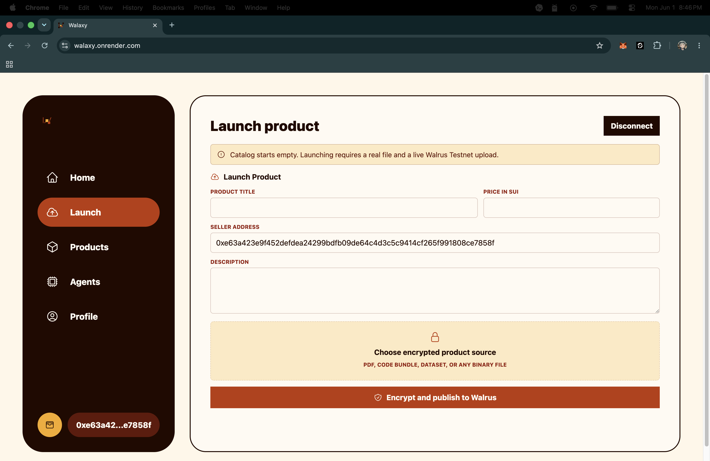

# Walaxy

Walaxy is a real Sui Testnet marketplace for encrypted digital products.
Sellers launch products to Walrus, humans buy with SUI, and agents buy through
native Sui x402.

No seeded listings are included. Listings and purchase receipts live in the Sui
Move contract. Product bytes are Seal-encrypted before they touch Walrus.

## Live

- App: https://walaxy.onrender.com
- Agent catalog: https://walaxy.onrender.com/api/products
- Health: https://walaxy.onrender.com/api/health

## Interface



## Run

```bash
npm install
npm run dev
```

Open `http://localhost:5173`.

## Product Flow

1. Connect a Sui wallet on Testnet.
2. Launch a product with a real file and seller address.
3. The server encrypts the file with Seal using the marketplace package namespace
   and a product `seal_id`.
4. The Seal ciphertext is uploaded to Walrus Testnet.
5. A public manifest is uploaded to Walrus with the Seal policy metadata.
6. The Sui marketplace contract stores the listing, Walrus blob IDs, and
   `seal_id`.
7. Buyers receive receipt objects after payment.
8. Seal key servers release decryption ability only when the buyer can prove
   receipt ownership through `marketplace::seal_approve_access`.

The backend does not store product decryption keys in `data/catalog.json`.

## Agent Buying

Agents discover products at:

```bash
GET http://localhost:8787/api/products
```

Each product includes `agentBuyUrl`:

```bash
GET http://localhost:8787/x402/products/<productId>/asset
```

Without payment, the server returns `402 Payment Required` with a
`PAYMENT-REQUIRED` header. Native Sui x402 is implemented with
`@tentaclepay/sui-x402` using the Exact scheme on `sui:testnet`.

After payment settlement, the server records an agent purchase receipt on-chain
and returns a Seal delivery descriptor. The included agent script fetches the
Walrus ciphertext, asks Seal key servers for receipt-gated keys, decrypts
locally, and writes the product file:

```bash
AGENT_SUI_SECRET_KEY=<sui-private-key> npm run agent:buy -- http://localhost:8787/x402/products/<productId>/asset
```

Native Sui x402 also requires a facilitator gas-owner key on the server:

```bash
X402_SUI_FACILITATOR_SECRET_KEY=<sui-private-key>
```

Keep it funded on Sui Testnet for gas.

## Contract

The Move package is in `move/walrus_exchange`.

```bash
npm run deploy:contract
```

The deploy command publishes the package, extracts the published package id and
the `marketplace::OperatorCap` object id, then writes only public deployment
values into `.env`:

```bash
SUI_PACKAGE_ID=<published-package-id>
SUI_OPERATOR_CAP_ID=<operator-cap-object-id>
```

The command uses the active Sui CLI wallet. It never reads or writes a private
key. If the CLI asks for a key or passphrase, that stays inside Sui tooling.

Runtime operator signing is separate from deployment. The backend needs
`SUI_OPERATOR_SECRET_KEY` for backend-written transactions: server-side product
creation and agent receipt recording after x402 settlement. Use a dedicated
funded service key that owns `SUI_OPERATOR_CAP_ID`.

## Configuration

Stable defaults live in `src/shared/config.ts`, not `.env`:

- Sui Testnet RPC
- Walrus Testnet publisher and aggregator
- upload limits
- Seal Testnet committee key server

Use `.env` only for deployed object ids and service keys:

- `SUI_PACKAGE_ID`
- `SUI_OPERATOR_CAP_ID`
- `SUI_OPERATOR_SECRET_KEY`
- `X402_SUI_FACILITATOR_SECRET_KEY`
